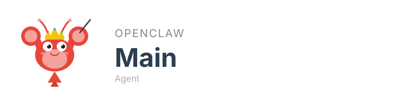

<p align="center">
  
</p>

# Openclaw Main Agent

The orchestrator present in every [Openclaw](https://docs.openclaw.ai/) installation. Monitors all other agents via the Inter-Agent Message Queue (IAMQ), dispatches information to the user via Telegram, and documents inter-agent interactions. This agent observes, routes, and reports — it performs no direct actions on external systems.

## Features

- Monitors all registered agents via IAMQ heartbeat and inbox polling
- Dispatches notifications to the user via Telegram
- Documents inter-agent interactions to the workspace filesystem
- Workspace health monitoring across the agent swarm

## Skills

| Skill | Description |
|-------|-------------|
| `agent_status_check` | Queries IAMQ to report online/offline status of all registered agents |

Skills are stored in `skills/` and auto-improve via post-execution hooks and nightly batch processing. Workspace-level skills (`iamq_message_send`, `log_learning`, `improve_skill`) are available via the shared `../skills` volume.

## Architecture

- **Language**: Elixir
- **IAMQ ID**: `main`
- **Runtime**: HOST-NATIVE (runs directly on the host, not in Docker)
- **Port**: N/A

### Communication layers

- **IAMQ** (Elixir bindings) — agent-to-agent message backbone
- **Telegram** — user-facing notifications
- **Filesystem** — workspace health monitoring

For details, see [spec/ARCHITECTURE.md](spec/ARCHITECTURE.md).

## Setup

Prerequisites: Docker or Podman. Nothing else.

```bash
git clone <repo-url>
cd openclaw-main-agent
cp .env.example .env
# Edit .env with your values
docker compose build
docker compose up
```

## Environment Variables

| Variable | Description |
|----------|-------------|
| `OPENCLAW_AGENTS_WORKSPACE_DIR` | Path to agents workspace |
| `IAMQ_HTTP_URL` | IAMQ server base URL (default: `http://127.0.0.1:18790`) |
| `IAMQ_AGENT_ID` | Always `main` for this agent |

Telegram notifications are managed by the OpenClaw gateway (`~/.openclaw/openclaw.json`).

## Volume Mounts

| Mount | Purpose |
|-------|---------|
| `../skills-cli:/skills-cli:ro` | Shared skills CLI tooling |
| `../skills:/workspace/skills:rw` | Workspace-level shared skills |
| `./skills:/agent/skills:rw` | Agent-specific skills |

## Links

- [openclaw-inter-agent-message-queue](https://github.com/r3dlex/openclaw-inter-agent-message-queue) — IAMQ backbone
- [Openclaw Documentation](https://docs.openclaw.ai/)
